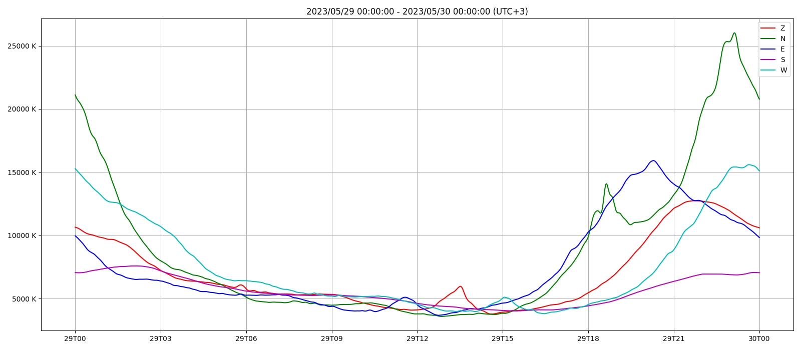

# pansy-galnoi

This Python program is a galactic noise level estimator for antenna arrays.  
[The PANSY radar](https://pansy.eps.s.u-tokyo.ac.jp/en/index.html) is the original target system for this program, but this is applicable to any antenna arrays.

## How it works

This program computes a product with the diffuse Galactic radio emission and the theoretical antenna pattern of an antenna array.

### The global diffuse sky models

- https://github.com/telegraphic/pygdsm

### Antenna array theory

- https://github.com/taishi-hashimoto/python-antarrlib

## Installation

Use pip.

```
pip install git+https://github.com/taishi-hashimoto/pansy-galnoi.git
```

## Usage

```$ pansy-galnoi --help
usage: pansy-galnoi [-h] [-f FREQUENCY] [--lat LAT] [--lon LON] [--antpos ANTPOS] [--antptn ANTPTN] [-b BEAMS] [-c COLORS] [-l LABELS] [-t TIMEZERO] [-d DURATION] [-n NT] [--localtime LOCALTIME] [--ze ZE] [--az AZ] [-j [JOBS]] [-o [OUTPUT]] [--check-patterns]
                    [--show]

Compute the theoretical galactic noise temperature observed by the specified antenna array (by default assuming the PANSY radar*).

options:
  -h, --help            show this help message and exit
  -f FREQUENCY, --frequency FREQUENCY
                        Radar frequency in Hz. Default is '47000000.0'.
  --lat LAT             Latitude of the observer.
                        Default is -69.0066066316.
  --lon LON             Longitude of the observer.
                        Default is 39.5930902267.
  --antpos ANTPOS       Path to antenna position file.
                        Default is "pansy-antpos.csv".
  --antptn ANTPTN       Path to antenna pattern file.
                        Default is "pansy-antptn.csv".
                        In the file, row corresponds to zenith angle, while column to azimuth angle.
                        Angles are measured CW from North (same hereafter).
  -b BEAMS, --beams BEAMS
                        Beam directions in degrees.
                        Must be a valid Python expression for a list of two-element tuple [(az, ze), (az, ze), ...].
                        Default is "[(0, 0), (0, 10), (90, 10), (180, 10), (270, 10)]".
  -c COLORS, --colors COLORS
                        Color specification for each beam.
                        Must be a valid Python expression for a list of matplotlib's color spec.
                        Default is "rgbmc".
  -l LABELS, --labels LABELS
                        Label names for each beam.
                        Must be a valid Python expression for a list of str.
                        Default is "ZNESW".
  -t TIMEZERO, --timezero TIMEZERO
                        Time origin in astropy Time format.
                        Default is now in UTC.
  -d DURATION, --duration DURATION
                        Duration in hours.
                        Default is 24 h.
  -n NT, --nt NT        The number of time ticks. Must be in an integer.
                        Default is 1441.
  --localtime LOCALTIME
                        Localtime offset in hours.
                        Default is 0.
  --ze ZE               Zenith directions for evaluating the whole sky.
                        Must be a valid Python expression for a tuple for `numpy.linspace()` argument: (start, stop, count).
                        Default is "(0, 90, 91)".
  --az AZ               Azimuth directions for evaluating the whole sky.
                        Must be a valid Python expression for a tuple for `numpy.linspace()` argument: (start, stop, count).
                        Default is "(-180, 180, 361)".
  -j [JOBS], --jobs [JOBS]
                        The number of processes.
                        Default is 1, max is {mp.cpu_count()}.
  -o [OUTPUT], --output [OUTPUT]
                        Output directory for evaluated galactic noise level measured by this antenna array.
                        By default, no CSV file is generated and only a graph shows up.
  --check-patterns      Show antenna patterns for debugging.
  --show                Show figure window.

*PANSY radar - https://pansy.eps.s.u-tokyo.ac.jp/en/index.html
  ```

## Example

```
$ pansy-galnoi -t "2023-05-29T00:00:00" -d 24 --localtime +3 --output examples
```

This will generate [a check plot](./examples/20230529.000000.png) below and [a source CSV file](./examples/20230529.000000.csv).


